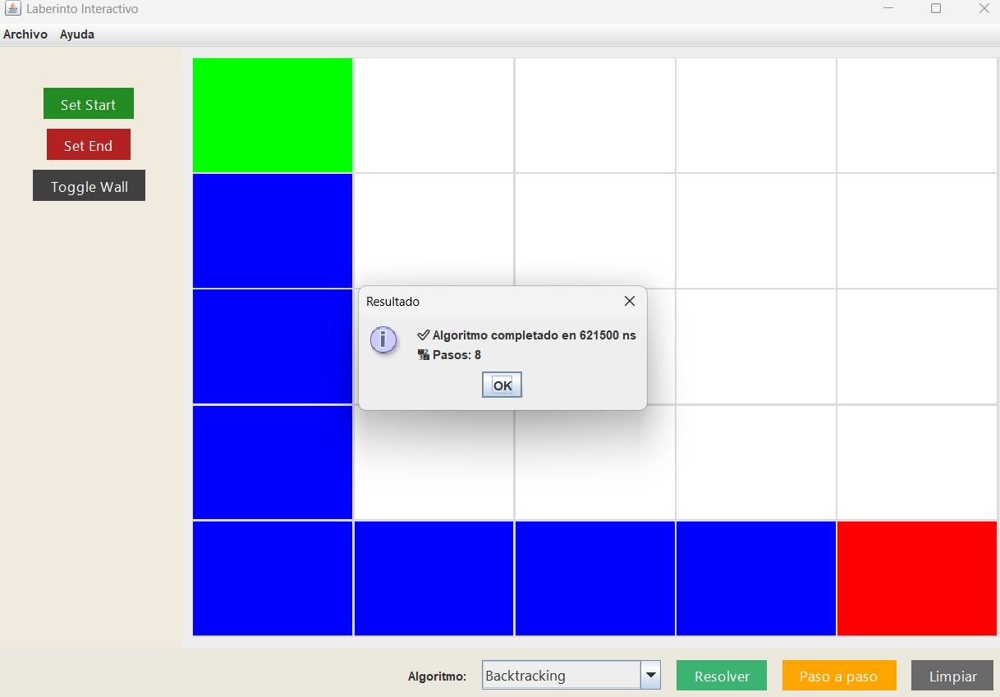
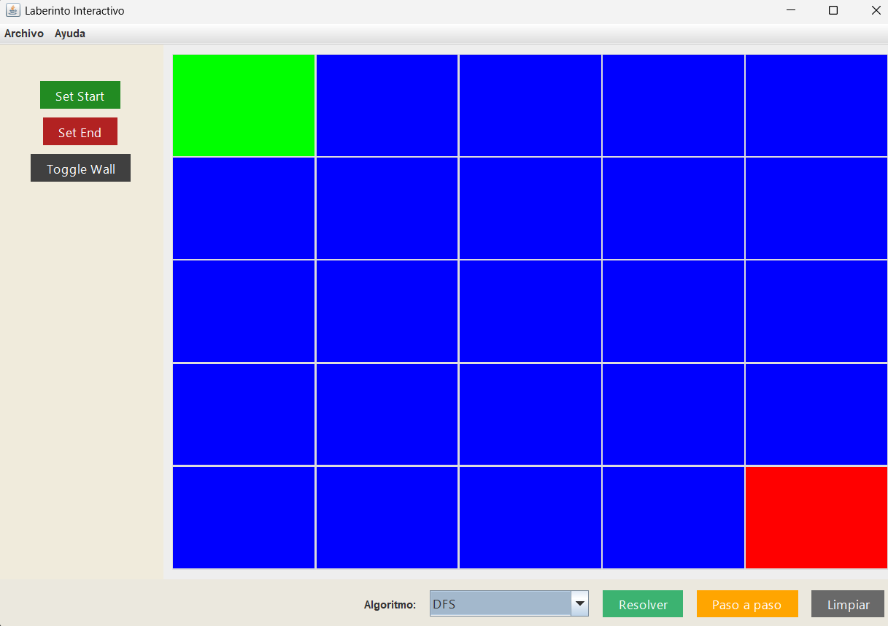
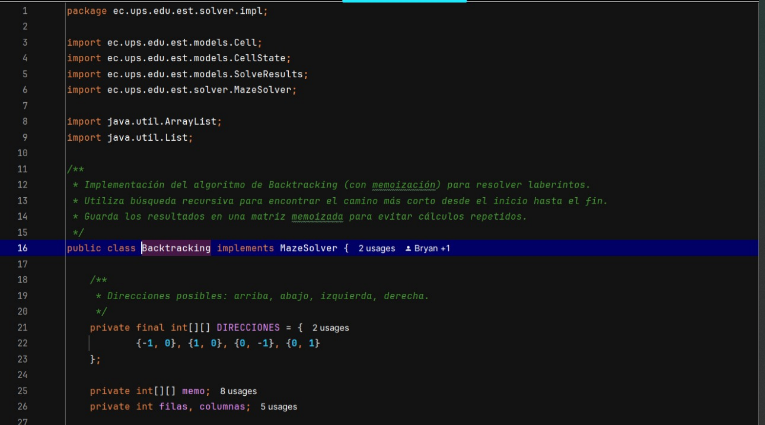
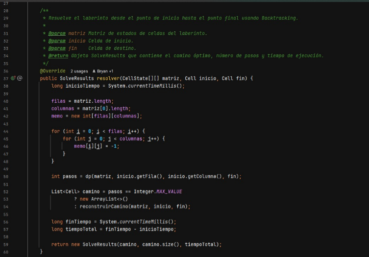
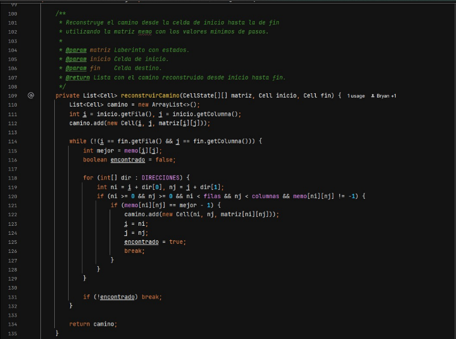
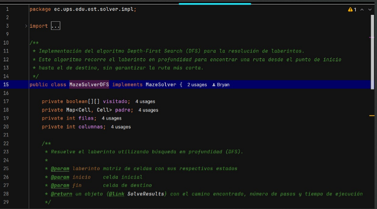
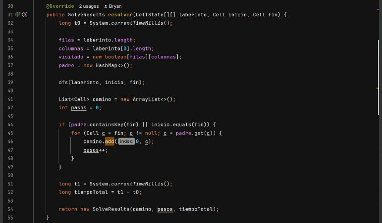
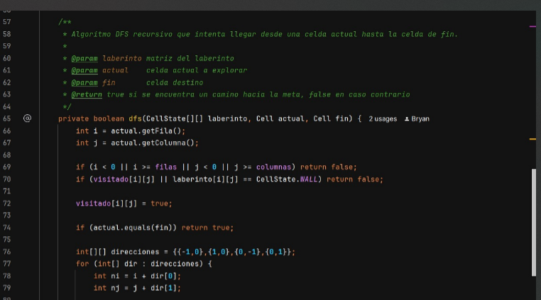
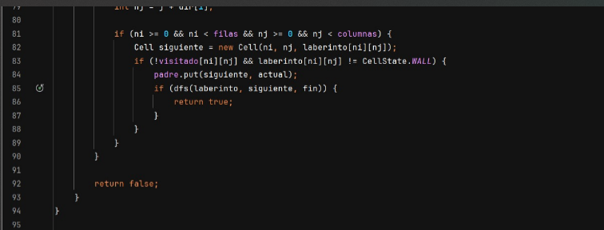

# Universidad Politécnica Salesiana

## Carrera de Computación
**Asignatura:** Estructura de Datos

**Proyecto Final: Resolución de Laberintos con Algoritmos de Búsqueda**

**Integrantes:** Keyra Carvajal / Diana Borja / Bryan Barros / Erika Collaguazo

**Correo institucional:**  kcarvajalc5@est.ups.edu.ec /  ----@est.ups.edu.ec /  bbarrosv@est.ups.edu.ec / ecollaguazo@est.ups.edu.ec

---

## 1. Descripción del problema

Este proyecto tiene como objetivo resolver de manera eficiente el problema de encontrar un camino óptimo dentro de un laberinto representado como una matriz bidimensional. El desafío consiste en determinar, desde un punto de inicio hasta un punto de destino, una ruta válida que evite obstáculos (muros) y minimice la cantidad de pasos o el tiempo computacional necesario.

Este tipo de problema se relaciona directamente con la programación dinámica, ya que en muchos casos el algoritmo debe tomar decisiones basadas en resultados previamente calculados para evitar repeticiones innecesarias. La programación dinámica permite optimizar los algoritmos recursivos que exploran múltiples caminos mediante técnicas como la memoización o la tabulación, mejorando significativamente el rendimiento.

A través de una interfaz visual construida en Java con Swing, el usuario puede diseñar laberintos personalizados, seleccionar entre diferentes algoritmos de búsqueda (DFS, BFS, recursivo simple, recursivo completo, backtracking, recursivo + backtracking) y observar en tiempo real cómo se ejecuta cada uno sobre la matriz. Esto permite comparar el rendimiento de los métodos tanto desde el punto de vista visual como estadístico, ya que se registran métricas como el número de pasos y el tiempo de ejecución.

El enfoque del proyecto no solo se centra en resolver el laberinto, sino en comprender cómo diferentes estrategias algorítmicas abordan un mismo problema, y cómo la programación dinámica puede optimizar estos métodos al reducir la redundancia y aprovechar subsoluciones ya exploradas.

---

## 2. Propuesta de solución

### - Marco teórico

#### 1.- DFS (Depth-First Search)
Algoritmo que explora caminos profundizando antes de retroceder. Usa una pila y puede encontrar una solución rápidamente, pero no garantiza que sea la más corta.

#### 2.- BFS (Breadth-First Search)
Explora el laberinto por niveles utilizando una cola. Asegura la ruta más corta, pero consume más memoria y puede ser más lento.

#### 3.- Recursivo (2D)
Versión simple que explora el laberinto hacia la derecha y abajo. Es útil para ver cómo funciona la recursión, pero es limitado en laberintos reales.

#### 4.- Recursivo 4D
Amplía el Recursivo 2D, permitiendo movimiento en las 4 direcciones. Tiene mayor cobertura y mejora la exploración del laberinto.

#### 5.- Recursivo 4D + Backtracking
Si un camino no lleva a la meta, retrocede y prueba otros caminos. Usa recursión con retroceso para garantizar solución. Más completo.

#### 6.- Backtracking Visual
Algoritmo de exploración exhaustiva que prueba todas las rutas posibles. Marca visualmente cada paso, retroceso y solución final. Ideal para observar el proceso paso a paso.

---

### Tecnologías utilizadas

- Lenguaje: **Java**
- Interfaz Gráfica: **Java Swing (AWT)**
- IDE: **IntelliJ IDEA**
- Control de versiones: **Git**
- Biblioteca de gráficas: **JFreeChart**
- Librerias: ** jcommon-1.0.2.4.jar ** */jfreechart-1.5.6.jar*
### Diagrama UML
-
-
-
-

**Explicación:**

-
-
-
## Capturas de interfaz
---
## Backtracking

---
## BFS

## Ejemplo de código:
### Algoritmo Backtracking

### Explicación

El algoritmo Backtracking es una técnica de búsqueda que explora todas las posibles rutas 
dentro de un laberinto, avanzando celda por celda desde un punto de inicio hasta un punto de fin. 
Si encuentra una pared, un límite o un camino sin salida, retrocede y prueba otra alternativa. 
En esta implementación se optimiza el recorrido mediante programación dinámica (memoización), 
lo que permite guardar el número mínimo de pasos necesarios desde cada celda hasta el destino, 
evitando recalcular trayectorias ya procesadas. El algoritmo construye el camino óptimo desde el 
inicio hasta el final y también registra el recorrido completo para fines de visualización. 
Es útil tanto para encontrar soluciones eficientes como para representar visualmente cómo el 
sistema explora el laberinto, mostrando primero el recorrido en gris y luego el camino final en azul.

---
### Algoritmo BFS (Breadth-First Search)

### Explicación
BFS (Breadth-First Search) o Búsqueda en Anchura es un algoritmo que recorre el laberinto 
expandiendo primero todas las celdas cercanas al punto de inicio antes de avanzar más lejos. 
Explora el laberinto por niveles, utilizando una cola (FIFO) para registrar los caminos por visitar.
A diferencia de Backtracking, BFS siempre encuentra el camino más corto en términos de cantidad de 
celdas visitadas, aunque no sigue una ruta visualmente directa. Es ideal para representar soluciones
rápidas y eficientes, especialmente cuando se necesita minimizar la distancia desde el origen al destino.

## 4. Conclusiones por estudiantes

### ✨ Erika Collaguazo
El algoritmo más completo y visualmente didáctico fue Backtracking, ya que permite observar tanto la exploración como los retrocesos del recorrido. Aunque no es el más eficiente en términos de tiempo, resulta ideal para comprender cómo se van construyendo y descartando las rutas.
Desde el punto de vista de rendimiento, el algoritmo BFS fue el más óptimo: encuentra el camino más corto con rapidez y precisión, sin necesidad de retrocesos innecesarios. Esto lo convierte en la mejor opción cuando se prioriza eficiencia.

The most complete and visually didactic algorithm was Backtracking, as it allows observing both the path exploration and the backtracking process. Although it is not the most time-efficient, it is ideal for understanding how paths are constructed and discarded.
From a performance perspective, BFS was the most optimal algorithm: it finds the shortest path quickly and accurately without unnecessary backtracking. This makes it the best option when efficiency is a priority.

### ✨ Bryan Barros
DFS puede llegar a una solución de manera rápida, pero no siempre garantiza que sea la más corta. Me pareció muy interesante ver cómo su comportamiento se ve afectado dependiendo de la distribución del laberinto, especialmente cuando hay muchos caminos posibles.
En cuanto a rendimiento, considero que el algoritmo Recursivo 4D + Backtracking logra un buen balance entre encontrar soluciones completas y mantener un tiempo de ejecución razonable.

DFS can reach a solution quickly, but it does not always guarantee the shortest path. I found it very interesting to see how its behavior changes depending on the maze’s layout, especially when there are many possible paths.
In terms of performance, I believe the 4D Recursive + Backtracking algorithm strikes a good balance between completeness and reasonable execution time.

### ✨ Diana Borja
Durante las pruebas realizadas, el algoritmo BFS demostró ser el más óptimo en laberintos grandes, gracias a su capacidad para explorar de forma ordenada y hallar el camino más corto sin repetir pasos.
Aunque Backtracking es menos eficiente en tiempo, su capacidad para mostrar paso a paso los retrocesos lo vuelve muy útil para visualizar y comprender el proceso de resolución, especialmente con estudiantes o en entornos educativos.

During the tests, BFS proved to be the most optimal in large mazes due to its ability to explore systematically and find the shortest path without repeating steps.
Although Backtracking is less efficient in terms of time, its ability to show each step and every backtrack makes it very useful for visualizing and understanding the solving process, especially in educational environments.

### ✨ Keyra Carvajal

Este proyecto fue una oportunidad para comprender cómo diversos algoritmos pueden abordar un mismo problema desde diferentes estrategias. La experiencia me ayudó a entender mejor el valor de la recursión y cómo su aplicación puede influir notablemente en el rendimiento según la estructura del laberinto.
Desde mi análisis, el algoritmo BFS fue el más óptimo por su rapidez y su capacidad para encontrar rutas eficientes. Sin embargo, la implementación del Backtracking me permitió visualizar con mayor claridad el proceso de resolución y los errores que se corrigen durante la búsqueda.

This project was an opportunity to understand how different algorithms can approach the same problem using different strategies. The experience helped me better grasp the value of recursion and how its use can significantly affect performance depending on the maze structure.
Based on my analysis, BFS was the most optimal algorithm due to its speed and efficiency in finding solutions. However, implementing Backtracking allowed me to clearly visualize the solving process and better understand the corrections made during the search.

## 5. Recomendaciones

-	Validar siempre la posición del inicio y fin antes de ejecutar el algoritmo.
-   Evitar laberintos demasiado grandes si no se optimiza la memoria.
-	Mostrar leyenda de colores para mejorar la experiencia del usuario.
-	Separar la lógica de resolución del código de la interfaz para facilitar el mantenimiento.
-	Comentar claramente cada parte del código para futuras modificaciones.

- Carefully analyze the maze structure before choosing an algorithm.
- Start testing with small mazes before scaling up to larger ones.
- Visual debugging helps a lot—take advantage of step-by-step mode.
- Use descriptive comments and clean code to ease collaboration.
- Explore Java Swing components to enhance user experience.
- Practice tracing recursive calls manually to understand algorithm flow.

## 6. Aplicaciones futuras
- Agregar un sistema de niveles o retos con laberintos de diferente tamaño y dificultad.
- Permitir guardar y cargar laberintos personalizados desde archivos.
- Incluir una opción para generar laberintos aleatorios automáticamente.
- Añadir animaciones más suaves para mejorar la visualización del recorrido.
- Incorporar sonido o efectos visuales al completar el laberinto.
- Implementar un historial de resultados para ver mejoras en tiempo o pasos.

-	Add a system of levels with mazes of increasing difficulty.
-	Enable saving and loading custom mazes from files.
-	Include an option to generate random mazes.
-	Add smoother animations for visual feedback.
-	Integrate sound effects or visual indicators for start/end points.
-	Implement a history or scoreboard to track performance.